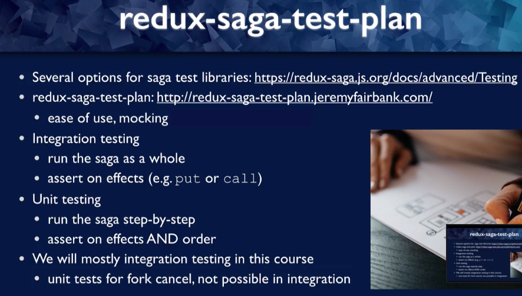
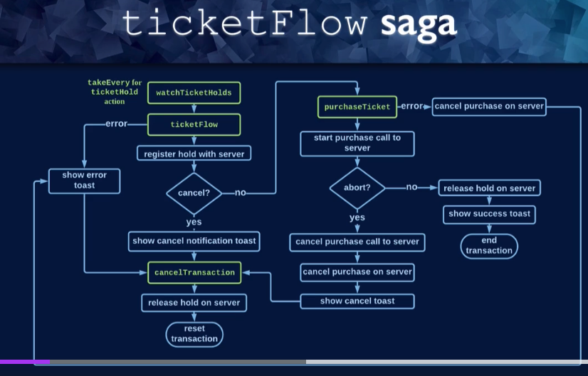

# Section 2: Using redux-saga-test-plan

## Introduction to redux-saga-test-plan



Some tests are not possible in form of integration test

## First saga test

`npm i -D redux-saga-test-plan`  

_base-app/client/src/features/toast/redux/LogErrorToastSaga.ts_
```js
export function* watchToasts(): SagaIterator {
  yield takeEvery(showToast.type, logErrorToasts);
}
```

here we need to pass action ourselves instead of _takeEvery_  

_base-app/client/src/features/toast/redux/logErrorToastSaga.test.ts_
```js
const errorToastOptions: ToastOptions = {
  title: "It's time to panic",
  status: "error",
};

const errorToastAction = {
  type: "test",
  payload: errorToastOptions,
};

test("saga calls analytics when it receives error toast", () => {
  return expectSaga(logErrorToasts, errorToastAction)
    .call(sendToAnalytics, errorToastOptions.title)
    .run();
});
```

- we have to use _return_ because _expectSaga_ is async
- as a result we expect to be called:
```js
  .call(sendToAnalytics, errorToastOptions.title)
```

## Code Quiz! Non-Error Toast

```js
const infoToastOptions: ToastOptions = {
  title: "It's not time to panic",
  status: "info",
};

const infoToastAction = {
  type: "test",
  payload: infoToastOptions,
};

test("saga does not call analytics when it receives info toast", () => {
  return expectSaga(logErrorToasts, infoToastAction)
    .not.call(sendToAnalytics, infoToastOptions.title)
    .run();
});
```

## Partial assertion

https://redux-saga-test-plan.jeremyfairbank.com/integration-testing/partial-matching.html  
We assert that we only call function regardless of args:
```js
test("saga does not call analytics when it receives info toast", () => {
  return expectSaga(logErrorToasts, infoToastAction)
    .not.call.fn(sendToAnalytics)
    .run();
});
```


# Section 3: testing complex saga that uses 'takeEvery'

## Introduction to ticketFlow saga



## Set up ticketFlow Saga Test File
